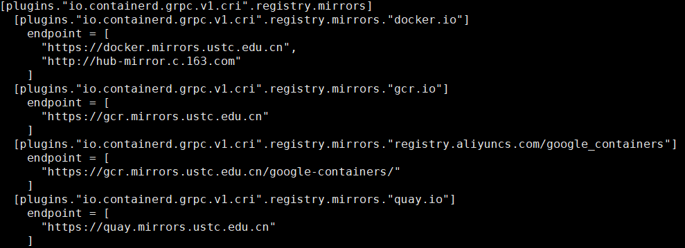

## k8s 安装总结
### master 节点
#### kubeadm.yaml配置文件注意
- 配置master节点ip时，应注意配置为eth0的地址，而不是服务器的公网ip，配置为公网ip执行kubeadm init时会出现`connection refused`
#### containerd 注意事项
- 配置containerd的配置文件`/etc/containerd/config.toml`
  - 需要修改其中的systemdCgroup为true，否则会选择cgroup模式
  - 修改sandbox版本为对应k8s需要的的版本
  - 修改containerd的`image`镜像和`sandbox`镜像为国内镜像，不修改镜像的话默认拉取国外的镜像.     
#### kubectl 注意事项
- kubectl分为`client` 和 `server`
  - client在kubectl安装之后就可以拿到
  - server需要k8s初始化之后才能够拿到
#### kubelet 注意事项
- kubelet也是k8s初始化之后才能`running`
#### kubeadm 注意事项
- kubeadm init 初始化一个k8s控制平面，同时将本节点设置为master节点
- kubeadm init 最好选取自定义的config文件，自动生成的文件中默认配置都是国外镜像源 
- 配置文件如图所示
    
- 同时服务器需要打开6443和10250端口
#### 节点间的网络通信
- 选择的是`calico`，flannel需要的端口2379在node节点中被占用
- calico 需要开启服务器5473端口

### node 节点
#### containerd 注意事项
- 与master节点中注意事项一致，猜测node中containerd的runc模块受损，需要手动安装runc   
- containerd启动镜像需要足够的空间，否则启动失败   
- containerd 依赖的libseccomp模块版本过低，需要手动下载高版本的libseccomp，对应的error log为   与runc出现在同一个error log中
#### kubeadm 注意事项
- 指向kubeadm join时需要指定cri-socket为containerd，否则默认为docksim，join失败
  - 主要原因为join过程中需要下载image，使用docksim默认下载是国外源，会超时。
#### kubectl 注意事项
- kubectl 如果在join之后还是只有client，那么需要手动的把master节点中的admin.conf复制过来并配置。
#### kubelet 注意事项
- 等待join过程唤醒即可。
  
### 网络问题
- k8s 如果不是第一次安装，首先需要手动清理`/etc/cni/net.d`文件夹，清空之前的网络配置，否则后续`apply calico or weave`会失败。
#### calico 踩坑
- `calico` 会有对应的 `k8s` 版本，使用之前需要注意版本是否一致，不对应的版本可能不会正常的响应服务。
- `calico` 需要打开的服务器本地端口需要按照官方文档依次打开，在这次使用中出现的错误为`bird.ctl`启动失败导致`calico`失败，但是`calico`配置文件已经修改为`ipip`模式，同时也打开了服务器本身的`ipip`模块，但是`calico`还是走了`BGP`模式，查看容器日志，也没有发现问题根因。但是第一次安装时是成功的，推测是存在历史文件导致后续配置失败。
- 推荐在空白服务器中使用`calico`，二次使用时需要特别注意历史配置文件，不是复杂需求建议使用`flannel`或者`weave`
#### weave 踩坑
- `weave` 安装相比于 `calico` 会简单很多，`weave` 配置时需要注意的点是添加一个配置项 `IPALLOC_RANGE` 配置为与 `k8s` 初始化时选择的 `podSubNet` 范围一致，保证网络的正常通信。
- `weave` 在安装时可能会出现 `1/2 running` 的情况，这种情况下需要查阅 `containerd` 中容器的日志来寻找原因，我遇到的问题日志显示需要`weave reset`，执行之后`weave`就会正常工作。
- 如果不是第一次安装网络插件，那么安装之后可能会出现插件正常运行但是节点状态还是`NotReady`，这个时候需要修改的是iptables中的规则，iptables的更新并不是实时的，需要做一定的修改
  - 当日志显示的错误是 `dial ip:port connection refused` 这个错误是需要刷新iptables，将iptables清空后，建立新的route rule，这时就能解决这个问题。
  - 当日志显示的错误是 `dial ip:443 i/o timeout` 这个错误是因为iptables没有放开写入，将iptables的INPUT， OUTPUT放开写入，就可以解决这个问题。
### istio 安装
#### 镜像下载
- istio默认通过docker下载镜像，通过containerd启动镜像，所以需要注意修改docker的镜像源保证拉取不会timeout，或者在可以拉取镜像的机器中先下载镜像，然后通过搭建本地镜像仓库的方式进行后续的istio搭建
#### istio ingress 安装
- ingress 安装时出错分为两方面的原因，一方面是docker镜像下载失败，一方面是上述提到的网络中iptables存在问题，需要查询日志去解决问题。

### 总结
- 先看日志，日志分为两类
  - k8s控制面中describe pod 可以看到一部分错误，简单的错误可以在这里发现，然后纠因去解决
  - containerd中运行的容器日志，可以看到每一个container的详细日志，适合解困复杂问题，需要锻炼查看日志并定位问题的能力。